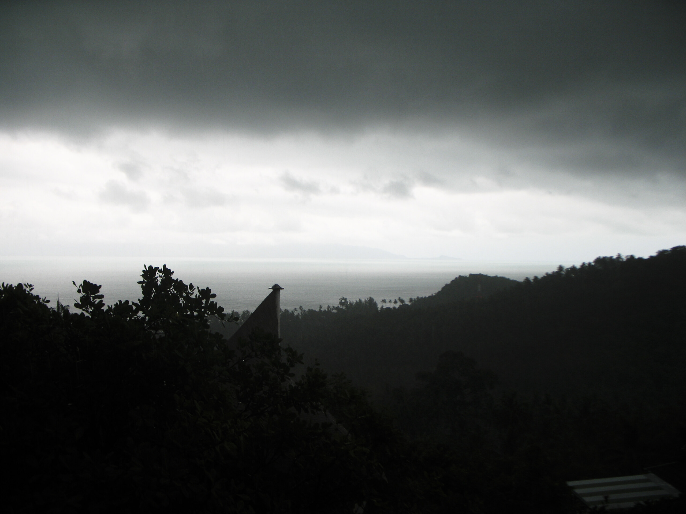

Lots of water

Eigentlich nimmt das Wetter im April Anlauf zur Trockenzeit, der Mai ist der Hitzemonat. In Khon Khaen im Norden Thailands hat man bereits den Wassernotstand ausgerufen --- kein Wasser mehr … Auf Samui war der vergangene Wochenanfang der heißeste dieses Jahres. Dann kam der Regen ;)

<!-- grammar-ignore DE_CASE Auf -->
