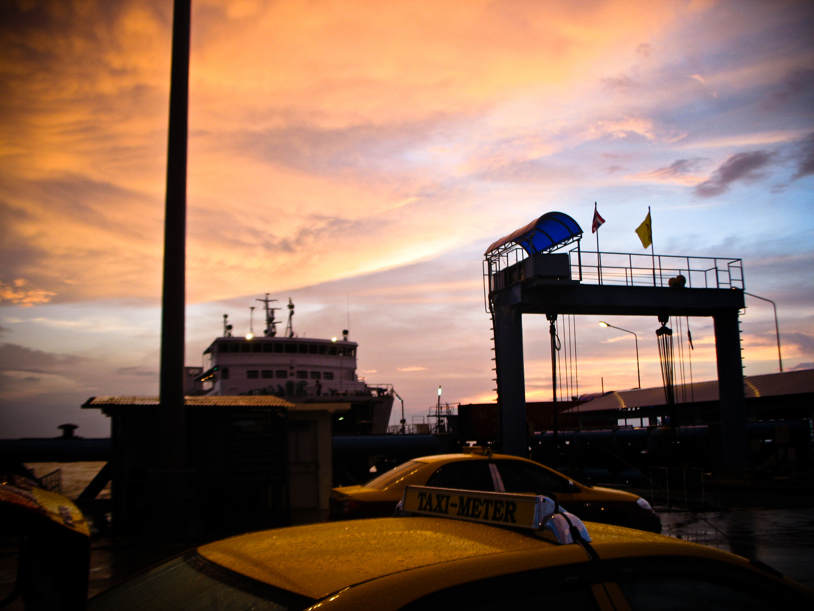

Back home

Zuhause ist man da, wo man Miete zahlt und das bin ich seit gut einer Woche wieder. Der Urlaub hatte sich zu einer Bildungsreise ausgewachsen und ich musste noch ein paar Tage Erholung einlegen.

Ausführliche Urlaubsberichte werden folgen, zuerst wollen 12.000 (ja, keine Null zu viel) Photos gesichtet werden. Keine Sorge, nur 1/12tel davon ist von mir.

Alle fünf meiner regelmäßigen Leser haben in den vergangenen Wochen gefragt, warum ich mein "Blog" nicht auch im Urlaub weiter schreibe … dann wärs ja kein Urlaub gewesen … nich wahr …

Hier noch schnell ein paar hastig nach der Rückkehr angefertigte Notizen (ehe ich mich für etwas Erholung entschied):

**Generell**

* Jawollja. Man ist wieder auf der Insel.

**Deutschland**

* Deutschland ist trocken. Die Luft hat meine Hände und Füsse rissig werden lassen. Echt jetzt. Nach 48 Stunden goldenen Landes war ich wieder im Vollbesitz meiner geschmeidigen seidenen Haut. Wasser in der Luft ist eine feine Sache (wir Verbalfetischisten nennen das gerne Hydrophilie).
* Deutschland ist kalt. Ich habe nie in meinem Leben so sehr gefroren. Es waren morgens nur 13 Grad und in der Sonne so gute 20 Grad. Aber nicht mehr. Schrecklich.

**Thailand**

* Hat keine Rapsfelder. Damit könnte man den König _so schön_ ehren. Aber da denkt wieder niemand dran. Ich bin noch am Überlegen, ob das eine Marktlücke ist. Falls ja, wo kann man denn Samen beziehen?

**Und dann**

* Wo ist eigentlich der für Mai versprochene Putsch hier in Thailand??

**Als ich wieder heim kam**

* Hab ich meine beiden Wuschel ganz fest geknuddelt und ihnen versprochen, sie nie wieder so lange alleine zu lassen. Genauso wie damals nach dem Januar 2007.
* Habe ich im Feedreader 15000 Einträge als gelesen markiert und immer noch rund 10000 zu lesende Einträge (inzwischen gelesen). Nein, ich bin nicht süchtig. Hab mal gelesen, dass man eine Sucht dadurch definieren kann, wenn der Süchtige nicht in der Lage ist, vom Suchtgegenstand mehr als 2 Wochen Abstand zu nehmen. Ich war gute drei Wochen offline …

<!-- grammar-ignore DOPPELTES_AUSRUFEZEICHEN ?? -->
<!-- cspell:ignore nich -->
<!-- cspell:ignore wärs -->
<!-- cspell:ignore Jawollja -->
<!-- cspell:ignore Verbalfetischisten -->
