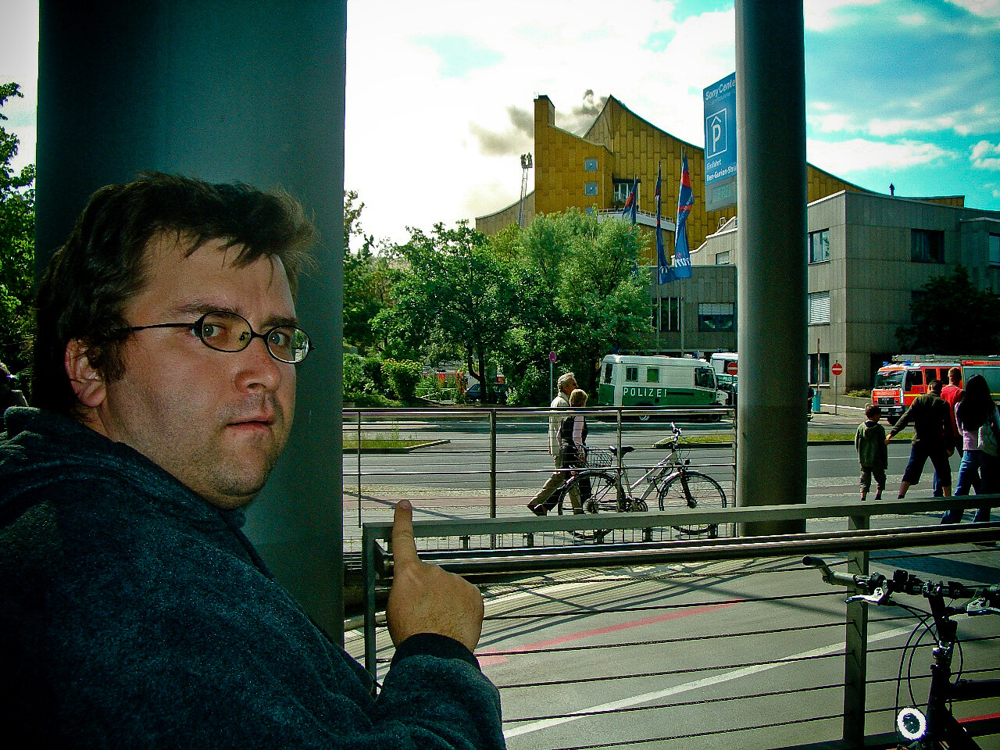

Burn baby burn!

Übrigens brannte die Philharmonie in Berlin, als wir da waren. Live vor Ort sozusagen. Es qualmte erst gelb, dann schwarz, dann wieder gelb und es wurde viel Wasser in das hässliche gelbe Gebäude gekippt. Man vergewisserte uns, es wäre nicht ungesund, wir assen Bagels und tranken Kaffee bei Dunkin’ Donuts und warteten, dass irgendwer uns als Augenzeuge befragte. Tat aber niemand. Es kamen immer nur Fahrradfahrer vorbei, die anhielten, ihre Photohandys zückten und "Oh Gott" und ähnliche Platitüden murmelten.

Abends brachte sogar CNN die brennende Musikerhalle.

Da werden wohl einige Berliner Elemente eine Weile lang in Ausweichgebäuden in karajanschen Erinnerungen schwelgen.

<!-- cspell:ignore karajanschen -->
<!-- cspell:ignore Dunkin -->
