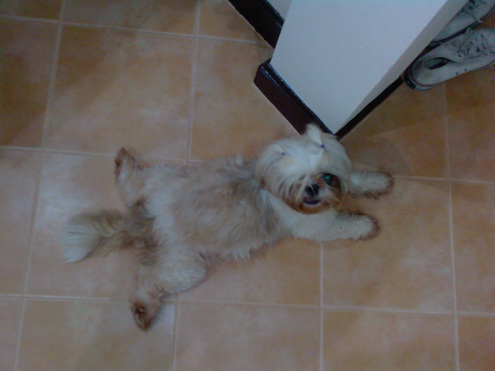

Soosie is simulating pregnancy (again)

Hier sehen wir Shihtzudame Soosie in der heißen Phase ihrer dritten Schwangerschaftssimulation. Locker die Beine in angenehmer Pose vom Körper abgewandt versucht sie mit ihrem dreiecksgleichem Leib möglichst viele Fliesen gleichzeitig abzudecken. Mit unschuldig jungfräulichem Blick versucht sie zu sagen: "Schwanger? Ich? Wie kommst du nur da drauf?"

Wenn man sie abtastet, vermeint man (wie bei den beiden vorhergehenden Simulationen) fröhliches Gehoppel zu spüren. Man produziert Milch. Wenn Pokki sie im Überschwang des Balldrangs überrennt (dreimal am Tag), dann nörgelt sie. Treppen lässt sie sich hochtragen.

Zwischen achtem und 16. August hat sie vermutlich (kraft meiner Abwesenheit und eines unfähigen Hundesitters) ihre Simulation begonnen, was bedeuten dürfte, dass in den Tagen nach dem 7. Oktober vermutlich viele vermutlich kleine vermutlich eingebildete Welpen rumfiepen werden. Oder auch nicht.

Ich glaubs erst, wenn ich es sehe.

<!-- cspell:ignore Shihtzudame -->
<!-- cspell:ignore rumfiepen -->
<!-- cspell:ignore glaubs -->
