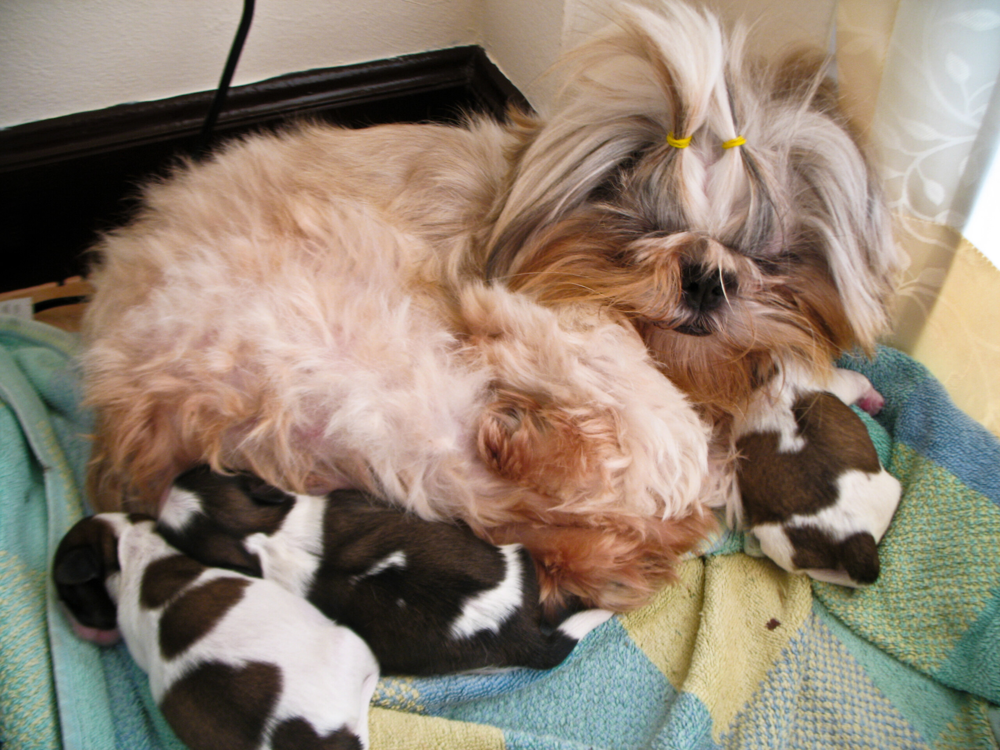

Tired (Day 4)

Nach 4 Tagen haben wir uns nun alle beruhigt. Soosie liegt in der Ecke und lässt die Mädels auf und unter sich rumsteigen, Pokki kommt hin und wieder zum Nest, schnüffelt unter den wachsamen Blicken von Soosie und murrt dann, dass ihm keine Aufmerksamkeit gewidmet wird. Nach langer Zeit verbringt er wieder den Großteil seiner Freizeit (Fressen ist ein harter Job) auf meinen Füßen.

Die Welpen benehmen sich und machen erstaunlicherweise gar nicht so viel Arbeit. Nachts, wenn Soosie versucht, an eine gemütlichere Stelle umzuziehen, quietschen und fiepen sie so lange, bis ich wach bin, ins Wohnzimmer laufe und Soosie kurz aber deutlich darauf aufmerksam mache, dass wenn man Sex haben will man auch mit dem Ergebnis leben muss und sich kümmern muss. Dreiviermal am Tag muss man das auch erklären, ansonsten funktionieren die Mutterinstinkte.

Nummer 1 robbt meist im Kreis herum. Nummer 2 liebt es, quer über den anderen zu liegen und Nike schafft es immer, in den Falten, Ritzen und Rollen, die das Handtuch in der Kuschelecke (das Hundenest ist verwaist, zu klein, auch nach ausgiebigem Waschen vermutlich noch der Geruch des Samstags vorhanden) so bietet zu verschwinden.

Nach der ersten Nacht fanden wir nur zwei kleine Shih-Tzu vor. Ich meinte dann zu Soosie "Kleine, gestern waren das noch drei" woraufhin sie dann doch erregt mitzusuchen begann. Nach einer Weile fanden wir Nike dann in der innersten Rolle des gefalteten Handtuches. Sie muss da aussen herum und um die Ecke gekrochen sein, ehe sie im Handtuch landete …

Egal … Sonst gibt es nichts Neues zu berichten. Nur vielleicht, dass das Gequietsche an den ersten beiden Tagen in etwa so klang, wie das jammervolle Quäken meines ersten Hamsters, als er an einer Verstopfung einging. Vielleicht ungefähr so, wie ein Frosch, dem man auf die Hinterbeine tritt, genau zu dem Zeitpunkt, an dem er zu quaken ansetzt.

<!-- grammar-ignore RAN_RUM_RAUF_REIN_RAUS_RUNTER_NEU rumsteigen -->
<!-- cspell:ignore rumsteigen -->
<!-- cspell:ignore Welpenmittwoch -->
<!-- grammar-ignore DE_CASE Sonst -->
