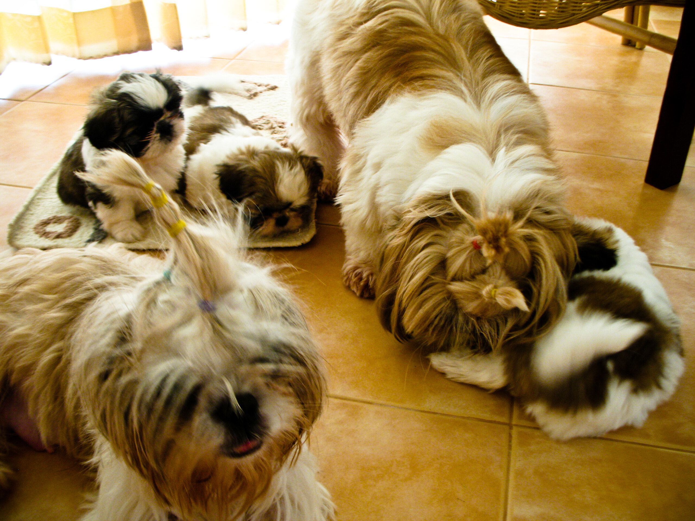

Fighting for the ball

Gestern, gute 7 Wochen nachdem Soosie plötzlich und unerwartet drei süße kleine Hundebabys geworfen hat, bemerkten die Bewohner hier im Ressort, dass wir Hundebabys haben. Dabei gehe ich seit gut drei Wochen beinahe täglich mit den Welpen raus, damit sie einerseits lernen, dass es sich draussen viel angenehmer pinkeln lässt und andererseits, weil ich da so eine These über junge Frauen, Hundebabys und soziale Kontakte habe.

Seither ist es jedenfalls nicht ruhig geworden am Poolhaus. Jeder hat irgendeinen Freund oder Freundin der oder die unbedingt kleine süße Puppies haben will und testet nur für den Freund oder die Freundin, wie süß und kuschelig die kleinen Puschel sind. Die Tatsache, dass es Mädchen sind (die Welpen), scheint sich auch noch positiv auf die Handelseigenschaften auszuwirken.

Heute Abend nun verlässt uns Nummer Zwei in liebevolle Hände zu einer Familie mit einer weiteren 8 Monate alten Shihtzu-Hündin (nicht aus Ressortbekanntschaften resultierend). Kann eigentlich nur gut sein, ich gehe davon aus, dass ich nur noch halb so viele Pfützen aufwischen muss, denn die beiden anderen wissen, wie man sich benimmt.

Die drei sind inzwischen so groß wie Pokki und Soosie waren, als sie ein paar Wochen schon bei mir gelebt haben. Entweder wurden die beiden schlecht gefüttert oder sie waren, wenn es hochkommt, nur 4 Wochen alt (da waren meine Welpen so groß wie Pokki bei seiner Ankunft), als sie verkauft wurden. Soosie war definitiv jünger, denn sie versteht nicht, zu spielen. Beides wirft ein eher bedenkliches Licht auf die "Züchter".

Die Welpen gedeihen und ich kämpfe hart mit mir, ob ich zwei oder drei abgebe. Ist ja schon etwas viel Arbeit. Aber sie sind doch soooooo süß!

<!-- grammar-ignore FRAGEZEICHEN_STATT_PUNKT . -->
<!-- cspell:ignore soooooo -->
<!-- cspell:ignore Ressortbekanntschaften -->
