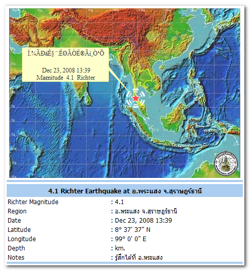

earthquake

Man sagt, hier hätte grade (vor einer Stunde) die Erde gebebt. Bildzeitungen weltweit werden morgen "Weihnachtsgeschenk! Die Flut blieb aus!" titeln und vier Jahre alte Bilder auf die ersten Seiten packen.

Gemerkt haben wir nichts, es fühlte sich nur kurz so an als ob ich mal wieder körpervolumenbedingt zu wenig gegessen hätte, was ja nicht selten ist in diesen Tagen …

<!-- grammar-ignore UPPERCASE_SENTENCE_START earthquake -->
<!-- cspell:ignore körpervolumenbedingt -->
