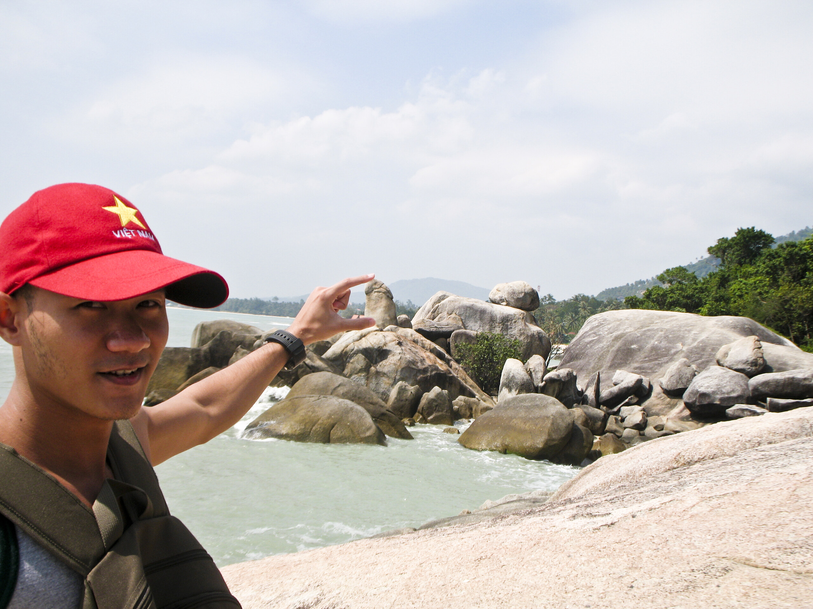

Its not a question of size

Wo man die Touristen hinbringt, die ausser dem Nacht- noch etwas anderes erleben wollen, muss ich mir jedes Mal wieder aufs Neue überlegen.

Es gibt ein paar "Viewpoints", von denen aus man aufs Meer starren kann, Wasserfälle (die regelmäßig zu rückversichernden Anrufen à la "wir sind jetzt am Wasser, muss man den Wasserfall irgendwo sehen" führen) und Hin Da Hin Yai, Großvater- und Großmutter-Steine, oben abgebildet.

Entertainment pur.

<!-- grammar-ignore DE_CASE Hin -->
<!-- grammar-ignore DE_CASE Da -->
