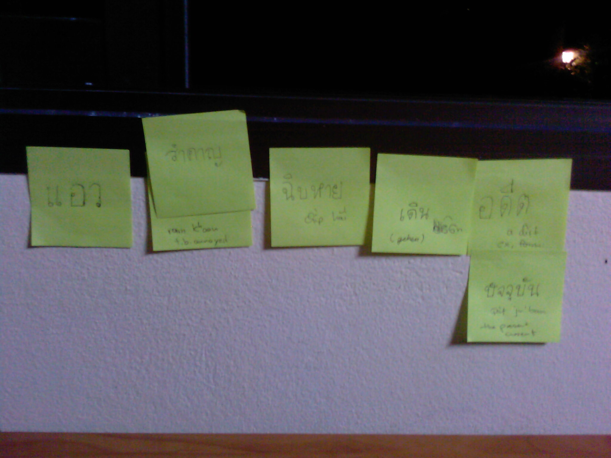

Learning Thai (reading and writing now)

Das Parlament Thailands hat immer viel zu tun, um das Land in eine bessere Zukunft zu führen und hatte neulich [eine erregte halbstündige erregte Diskussion][1] darüber, ob ein bestimmtes Wort nun unhöflich im täglichen Debattengebrauch sei. Es ging um "chip hai", was soviel wie "Desaster" bedeutet und ein eher umgangssprachliches Wort ist. (Im Bild oben ist chip hai das Wort ohne Übersetzung in der Mitte ;)

Am Ende wurde dann (zwar ohne demokratische Abstimmung aber nichtsdestotrotz wirksam) durch den Haussprecher festgelegt, dass chip hai nicht Vulgärthai ist.

Man darf also ungestraft Sachen wie bspw. "Thaksin ben chip hai mueang thai" sagen. Zumindest in Hinsicht auf die Sprachwahl.

Wenn das Parlament nicht gerade Wortwahl betreibt, dann wählt es sich neu, löst sich auf oder verteilt (einmalig) 2000 Baht an jeden Thai der weniger als 12000 Baht (weniger als 300 Euro) im Monat verdient.

 [1]: https://web.archive.org/web/20090414202849/http://www.nationmultimedia.com/news/30098428/Thai-word-of-%22disaster

<!-- cspell:ignore Debattengebrauch -->
<!-- cspell:ignore Vulgärthai -->
<!-- grammar-ignore UNPAIRED_BRACKETS ( -->
