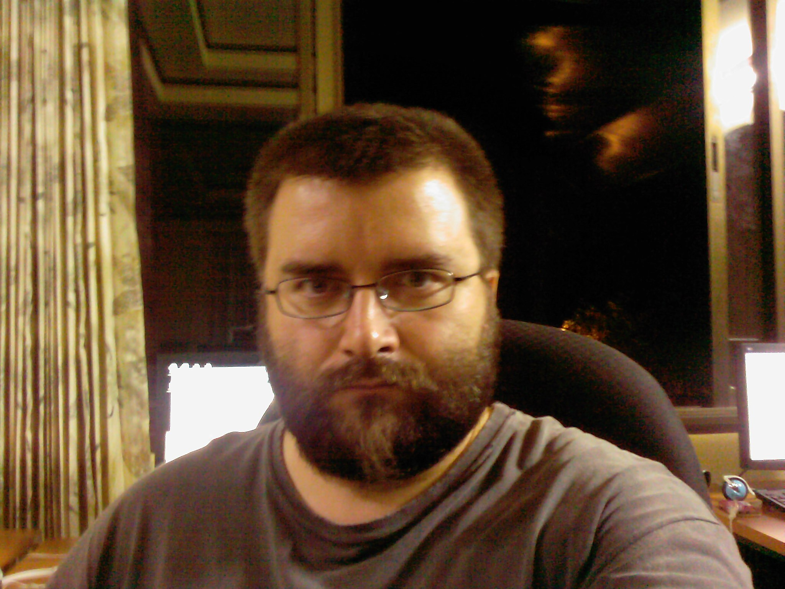

Heute erfuhr mein Unterhaupt eine Rasur. Hin und wieder lasse ich die Gesichtsbehaarung ja schon mal [wachsen wie sie will][1]. Aus Faulheit oder weil gewisse Gesichtszüge eine zu starke Gewichtszunahme indizieren. Letzteres diesmal.

<figure id="photo-3926628248">

</figure>

Wohlwollend nach Rasur festgestellt, dass die Pausbäckchen und das Doppelkinn mit dem Bart verschwunden sind. Puh. [Das ging ja nochmal glatt …][2]

Ich finde immer wieder interessant, wie viele Leute doch nach dem Äußeren gehen. Egal.

Der Langhaarschneider ist übrigens tot. Daher das noch lange Oberhaupthaar.

 [1]: #photo-3926628248
 [2]: /2009/09/langnase/
