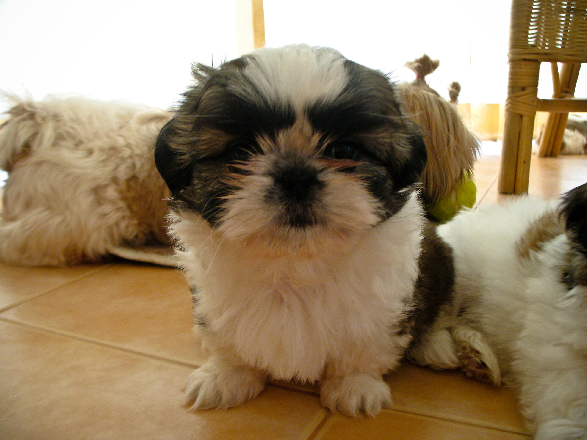

Nikki (7 Weeks old)

Heute wurde Nikkie 1 Jahr alt. Vor genau einem Jahr (auf diesem Photo liegt sie ganz rechts als schwarz geschecktes kleines Etwas an der mütterlichen Nahrungsversorgung) kamen an einem recht aufregenden Samstagmorgen drei kleine Shih-Tzus zur Welt. Seither bezeichne ich mich gerne als Züchter.

Aus Nike (wir Kenner sprechen das gerne wie Nai-Kiiiih aus) wurde Nikkie. Ein kleines Fellbündel. Es waren 12 recht interessante Monate, in denen Nikkie erst süß, dann aufsässig, dann nervig und dann ein Familienmitglied wurde. Die Chance sie wegzugeben und nicht zu lieben habe ich schon lange verspielt.

(Neue) Photos gibt es leider nicht, weil es heute unmittelbar nach dem Hundeduschbad zu regnen begann und alle drei Viecher die Gelegenheit nutzten, mich um vier vergeudete Arbeitsstunden trauern zu lassen.

<!-- cspell:ignore Kiiiih -->
<!-- grammar-ignore DE_CASE Etwas -->
