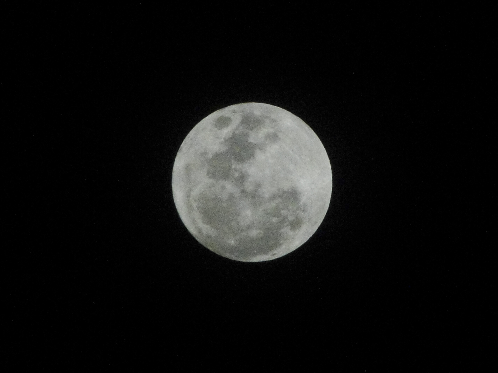

Full moon over Samui on Makha Bucha day

Heute ist Makha Bucha Day, einer der drei wichtigeren buddhistischen Feiertage. Und ich nehme gut 50 % aller schlechten Bemerkungen über das Nachtphotoverhalten meiner neuen Kamera zurück. Aber nur 50 %. Gestern hab ich mir übrigens Benicio Del Toro's Wolfman angesehen --- passend zum Vollmond.
