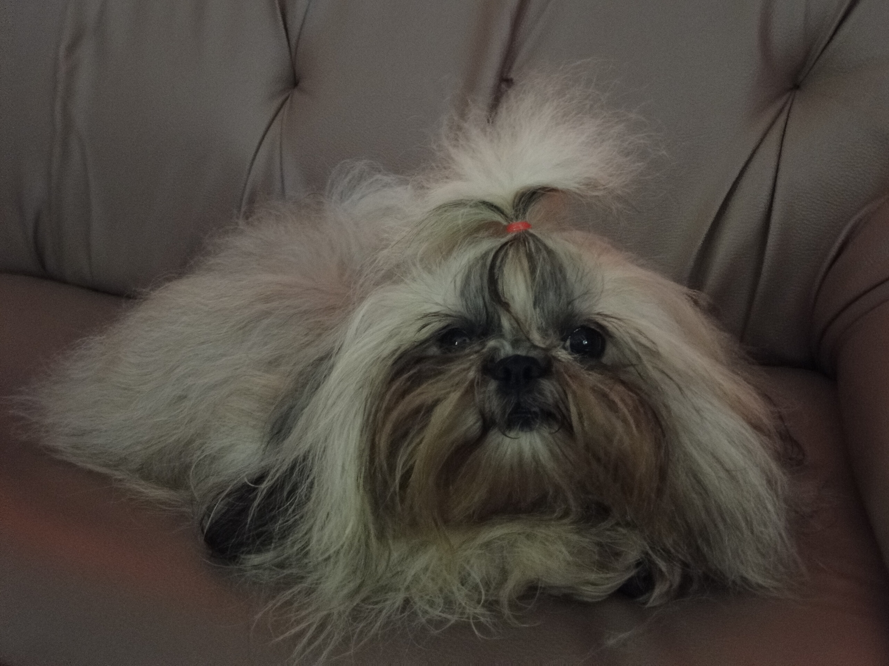

Bye bye baby!

Heute, gut 22 Monate nach dem Ende von Soosies Scheinschwangerschaft hat auch Nikkie eine neue Heimat gefunden. Damit sind alle drei Babys in gute Hände abgegeben.

Was nun folgt, ist die Depriphase nach dem Auszug. Soosie sucht in allen Ecken des Hauses nach Nikkie. Pokki legt mir die Pfoten auf die Beine und schaut mir fragend in die Augen. Beide versuchen sich so brav wie nur möglich zu benehmen, da ein allgemeiner Zusammenhang zwischen meiner Laune und dem Verbleib aller caninen Bewohner vermutet wird. Wir alle sind etwas deprimiert.

Ich habe übrigens schon eine Stunde nach dem Auszug den ersten Panikanruf bekommen, sie trinkt kein Wasser. Warum auch --- wenn die Umgebung aufregender als der Wassertrog ist, trinkt man halt nicht. Was hier immer wirkt, ist ein Eiswürfel --- der ist aufregender als neue Umgebungen …

<!-- cspell:ignore Depriphase -->
