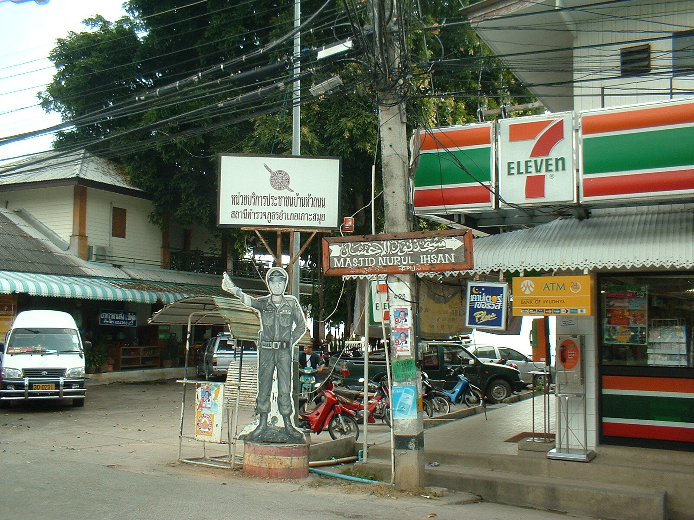

Police Sergeant Indifferent

Das die Polizei in Thailand etwas übereifrig ist, wenn es darum geht, das Gesicht zu wahren oder gar die Popularität zu verbessern, habe ich schon das eine oder andere Mal angemerkt.

Am Mittwoch war der Nationale Tag der Polizei in Thailand. Grund, mal wieder rührend in der Medientrommel zu rühren.

<strong>Aktion 1 --- Neue Plastik-Polizisten</strong>

Jeder, der schonmal in Thailand war, wird sie kennen --- An Kreuzungen und unübersichtlichen Stellen im Strassenverkehr stehen Papp- (siehe Bild oben) und Plastik-Polizisten. Das soll den Bürgern ein gutes Gefuehl geben und die Fahrer zu Vorsicht mahnen. Die Psychologie dahinter ist wohl, dass man (wenn man das erste Mal vorbeikommt) nicht erkennen kann, ob da nun ein echter oder ein Papp-Polizist steht --- und manch ein Thai hat noch Respekt vor den Gesetzeshütern.

Das aktuelle "Modell" heisst Police Sergeant "Indifferent", was wohl soviel wie gleichgültig heißen soll.

Ab nächsten Monat nun sollen neue Polizei-Statuen aufgestellt werden, die wie hier bekannte männliche Teenie-Stars [<a href="http://www.google.com/images?hl=en&source=imghp&biw=1280&bih=690&q=Ken+Theeradetch&btnG=Search+Images&gbv=2&aq=f&aqi=&aql=&oq=&gs_rfai">1</a> oder <a href="http://www.google.com/images?hl=en&safe=off&biw=1280&bih=690&gbv=2&tbs=isch:1&sa=1&q=Chakrit+Yaemnam&btnG=Search&aq=f&aqi=&aql=&oq=&gs_rfai">2</a>] aussehen.

Mechanisch winken sollen sie auch noch --- also die Statuen, nicht die Stars.

Laut den Verantwortlichen des Projektes braucht man eine Woche, um die Plastik-Polizisten zu "designen" und weitere 10 Tage, um sie zu produzieren und aufzustellen. Klingt mir sehr nach einer sehr spontanen Idee und typisch thailändischer Projektplanung.

Weitere 3 Tage wird es dann dauern, bis die weiblichen (und männlichen) Fans den Großteil der Statuen wieder abgebaut und neben das heimische Bett gestellt haben.

<strong>Aktion 2 --- Der "No Traffic Tickets"-Tag:</strong>

Mittwoch war dann nicht nur der Tag der Polizisten, es war auch der "No Traffic Tickets"-Tag, an dem keine Strafzettel verteilt wurden. Verkehrssünder wurden nur verwarnt und Leute, die ausstehende Strafzettel bezahlten, erhielten wohl einen Nachlass oder mussten nur einen Mindestbetrag zahlen.

So macht das Rasen viel mehr Spass.

<strong>Aktion 3 --- Die Leute, die den Kopf lieben</strong>

Aktionen (und, ehm, Parteien und Organisationen), die in der Öffentlichkeit gerne wohlwollend aufgenommen werden wollen, enthalten immer wieder Liebe im Namen. So gibt es eine Organisation namens "People who love the head", welche versucht, die Leute zum Tragen von Helmen zu bewegen, wenn sie sich auf Motorrollern und -rädern im Straßenverkehr bewegen.

Die Leute, die am Mittwoch ohne Helm erwischt wurden, bekamen statt einer 300 Baht-Rechnung (Haupteinnahmequelle jeder kleinereren Polizeistation im Königreich) einen kostenlosen Helm.

<strong>und dann: Die Umfrage</strong>

In einer Umfrage wurden die Bürger zu ihren "Gefühlen" hinsichtlich der Polizei befragt.

Heraus kam (natürlich), dass sich jeder wünscht, dass die Polizei Gewalt und Unruhen im Lande löst und dass sich alle sicher und beschützt fühlen.

Leider ist nur einmal im Jahr der Nationale Tag der Polizei.

<!-- grammar-ignore DE_CASE Nationale -->
<!-- grammar-ignore DE_CASE Neue -->
<!-- grammar-ignore DE_CASE An -->
<!-- grammar-ignore DE_CASE Der -->
<!-- grammar-ignore DE_CASE Die -->
<!-- grammar-ignore UPPERCASE_SENTENCE_START und -->
<!-- grammar-ignore DE_REPEATEDWORDS_NUN nun -->
