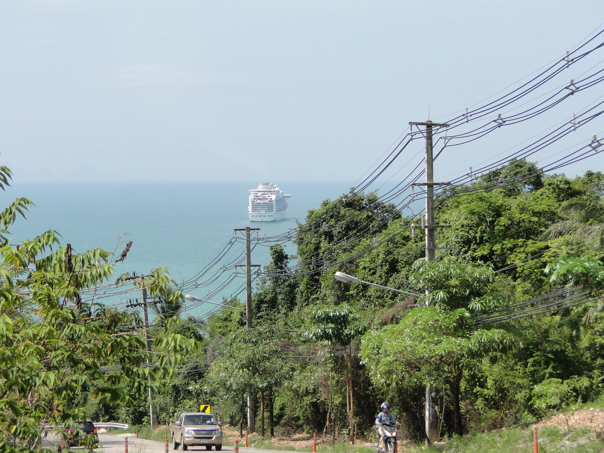
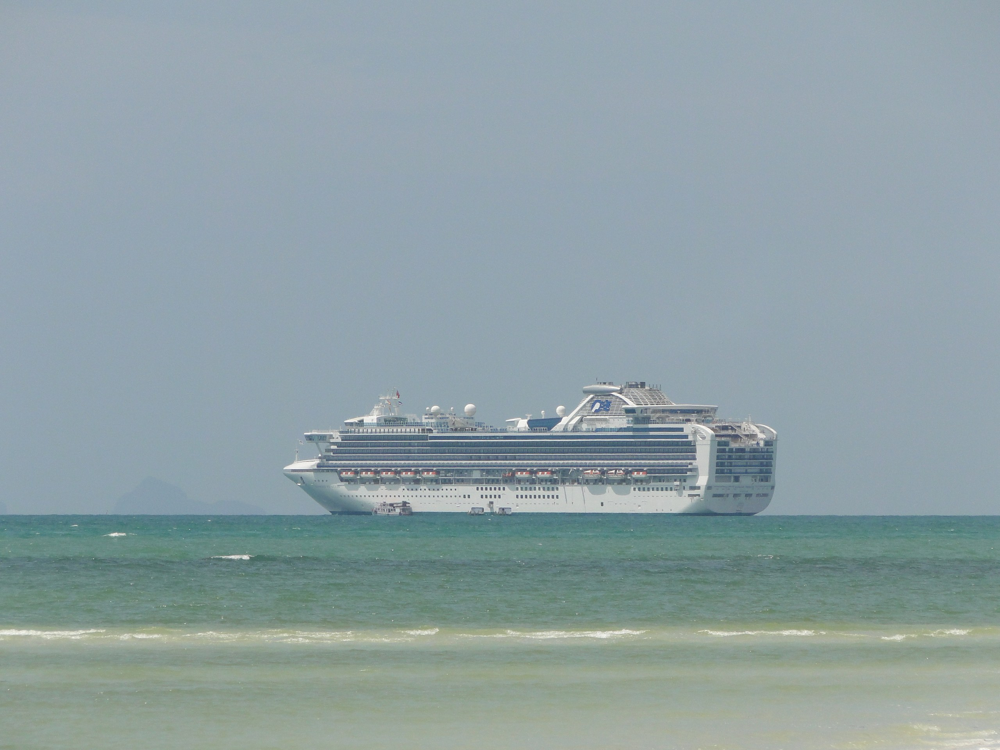

"Diamond Princess" visits Koh Samui

Heute Morgen stand ich auf meiner Terrasse, schlürfte meinen billigen Instant-Kaffee und schaute irritiert in der Gegend rum. Im Abstand von rund drei Minuten kamen große Reisebusse aus Phuket vorbeigerauscht, mit vielen kleineren Autos im Tross, die nicht überholen konnten. Also richtig echter Großstadtverkehr.

Als ich dann später in die Inselhauptstadt fuhr, wurde mir schon auf dem Berg klar, woran das lag: Es ankerte vor der Küste Nathons mal wieder ein Kreuzfahrtschiff. Die älteren unter meinen Lesern (jene, welche den Hype um (echte) Menschen auf dem Mond noch halbwegs bewusst mitbekommen haben) werden sich an jene Serie im ZDF erinnern, in der ein gewisses deutsches Kreuzfahrtschiff die Welt durchreiste und jede Menge persönlicher Probleme gelöst wurden, wenn man nicht gerade auf Landgang war. Genausoeindinglagvorunsererküstevoranker.

Heute nun hatten die 2.600 Passagiere der "Diamond Princess" Landgang auf Samui. Nathon war voller neugieriger Touristen, größtenteils aus China und Korea (soweit ich das beurteilen kann).

Ich war hocherfreut, konnte ich doch wieder eine Testreihe meiner Jahre alten Theorie fahren, dass sich koreanische Pärchen, die nach Thailand reisen, aus überdurchschnittlich hübschen Frauen und überdurchschnittlich hässlichen Männern zusammen setzen. Wenn man das mit den Boygroups aus Korea vergleicht, wundert man sich, warum es zu so großen Diskrepanzen kommen kann. Egal. Ich schweife ab …

Inzwischen sitzen all die glücklichen Kreuzfahrer im Käptns-Dinner und lösen wieder ihre persönlichen Konflikte und Liebschaften bis ihre Reise dann ein geplant fröhliches Ende in Singapore nimmt, wohin man, soweit ich das dem Internet entnehmen kann von China aus reiste.

PS: In Großansicht sieht das Schiffchen übrigens [so](#photo-5092893967) aus.

<figure id="photo-5092893967">

</figure>

<!-- cspell:ignore Genausoeindinglagvorunsererküstevoranker -->
<!-- cspell:ignore Käptns -->
<!-- grammar-ignore RAN_RUM_RAUF_REIN_RAUS_RUNTER rum -->
