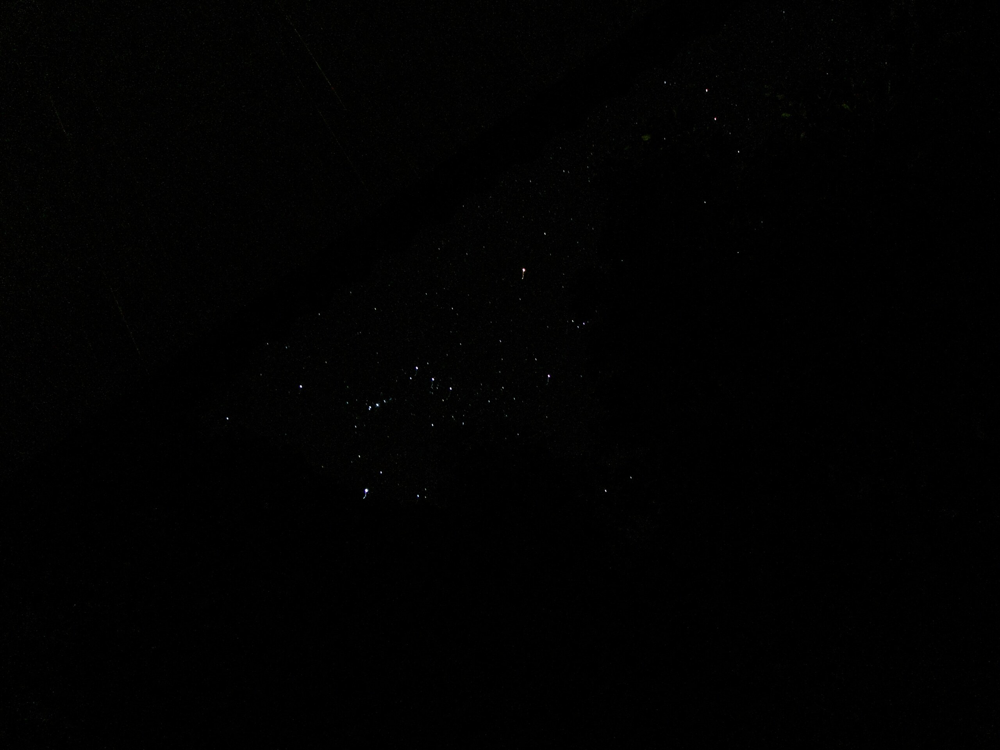

We are not alone

Gestern fiel mal wieder in der Gegend der Strom aus. Der ganzen Sache vorausgegangen war eine ziemlich laute Explosion in Maenam. Ich war also vorgewarnt und entschloss mich, mal zu sehen, was die Kamera denn in Hinsicht auf das Photographieren von Sternen hergibt. Ich denke, da kann ich noch viel lernen, trotzdem gefällt mir das Bild oben ganz gut.

Ohne Stromausfall sieht man meist nur ein paar Sterne, weil die Insel dann doch recht stark den Nachthimmel erhellt. Absolute Dunkelheit ist eine schöne Sache.
