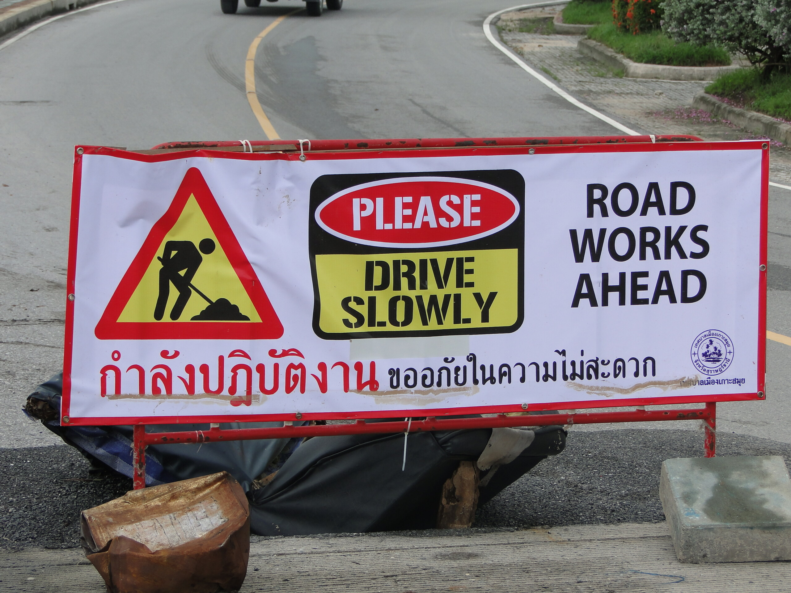

The day after --- road works ahead

Ich lade gerade ein paar Photos von meiner Inselrundfahrt gestern hoch, im Album The day after auf flickr.com kann man sie alle sehen. Heute bin ich ziemlich beschäftigt, werde aber, wenn alles so läuft wie geplant, im Fishermans Village und in Chaweng vorbeisehen können.

Die Straßen sind an vielen Stellen zerstört oder von Schlaglöchern übersät. Die vielen Erdrutsche in den Bergen sind erstaunlicherweise recht schnell behoben worden --- bis auf den Steinbruch in Lamai. Dort drängelt sich der Verkehr --- ohne Polizei oder Verkehrsregelung --- auf einem Drittel der normalen Straßenbreite durch die Landschaft.

Später mehr.

<!-- cspell:ignore Fishermans -->
