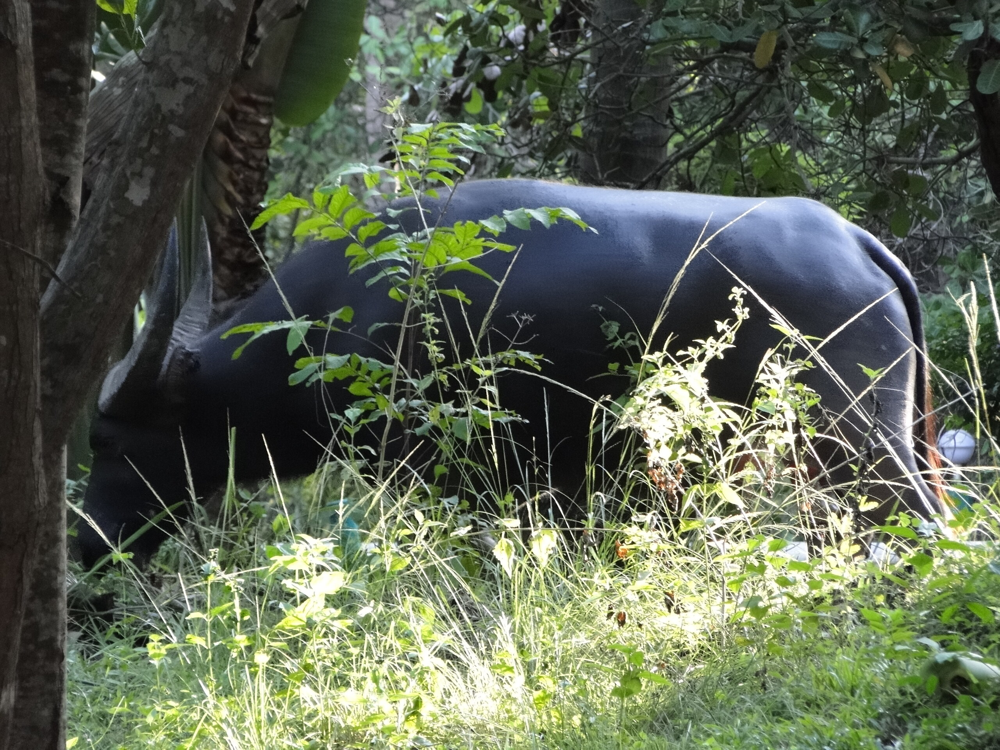

Monster

Gestern Nacht, ich saß gerade mit einer Flasche Bier auf einem meiner neuen Pool-Liegestühle (so ein abgesoffenes Resort hat hin und wieder etwas Gutes), da begann es im Dunkel auf der anderen Seite des Grabens zu rascheln, zu knacken und dumpf zu poltern.

Nun ist das an und für sich nichts Besonderes, denn der nicht unbedingt intelligente Nachtwächter am Tor des nachbarlichen Resorts kommt häufiger zum Wasser lassen, stolpert dabei unnüchtern durchs Gestrüpp und zeigt mir Dinge, die ich lieber ungesehen gelassen hätte.

Interessanterweise standen beide Hunde auf der Terrasse und starrten zitternd und ohne zu bellen ins Dunkel, was eher unnormal war. Also starrte auch ich ins Dunkel (allerdings ohne zu zittern) und versuchte den Krachmacher zu erkennen. Dann rutschte ein dunkler Schatten mit viel Geräusch in den Graben und begann wütend zu schnauben. Soosie rannte ins Haus und blaffte ein paar Mal in Richtung des Tumults und verschwand dann unter den Tisch. Pokki setzte sich zu meinen Füßen nieder und begann zu knurren.

Nun lass ich mir ja nicht wirklich von den Hunden vorschreiben, wann ich ins Haus zu gehen habe --- das hier waren dann aber genug Anzeichen einer aussergewöhnlichen Situation, also zog auch ich mich in die Tür zurück und harrte der Dinge, die da kommen mögen.

Der Schatten, den ich da im Dunkel sehen konnte, sah aus wie ein sehr großes Wildschwein. Sehr, sehr groß. Ich hatte gerade "Hannibal" gesehen, ein sehr empfehlenswerter Naturfilm, wo hungrige Wildschweine den armen Gary Oldman verspeisen.

Es war dann allerdings nur ein Wasserbüffel. Der versuchte gut eine halbe Stunde auf der einen oder anderen Seite des Grabens herauszukommen --- meine Hunde standen je nach Zielgrabenseite knurrend in der Tür oder auf der Treppe --- und war dann endlich auf der Gegenseite erfolgreich, wo er erzürnt noch ein paar Büsche zerfetze und sich nach einer Weile niederließ.

Nachts gegen zwei kam dann Büffels Herrchen vorbei und pflockte ihn wieder an, diesmal unter maßregelndem Gebell meiner Kleinen.

Heute Morgen lief der Büffel schon wieder frei vor meinem Haus herum. Dann wurde er wieder festgezurrt und ich beruhigend (oder peinlich berührt, je nach Interpretation) über den Khlong hinweg angelächelt.

Jetzt grade wandert er wieder frei in der Gegend herum. Wie gut, dass Wasserbüffel, wenn sie satt sind (und dieser hier dürfte es inzwischen sein), eher lethargische Gestalten sind. Wenn sie nicht gerade in einen Graben fallen.

<!-- cspell:ignore unnüchtern -->
<!-- cspell:ignore pflockte -->
<!-- grammar-ignore DE_REPEATEDWORDS_NUN Nun -->
<!-- grammar-ignore ERSTE_PERSON_SIN_OHNE_E lass -->
<!-- grammar-ignore SUBJUNKTION_KOMMA_2 Wenn -->
