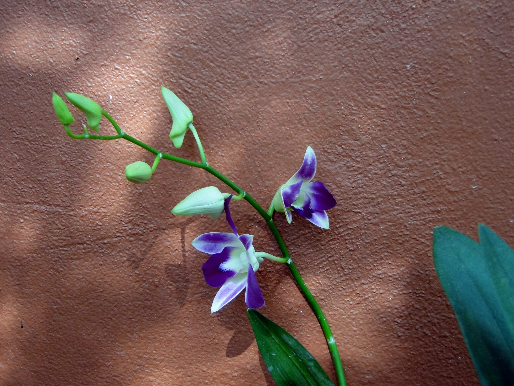

Number One (and two too)

Vorgestern erblühte endlich die erste meiner aus dem abgesoffenen Resort geretteten Orchideen. Die ärmsten lagen nach den Fluten nämlich einfach so in der Gegend herum und vertrockneten ungeliebt.

Nach ein paar Wochen Wasser und gutem Zureden ("wenn ihr jetzt bald blüht dann kommt ihr ins Internet") poppen nun Rispen an allen Pflanzen und die ersten beiden Blüten sind offen. Wie schön.

Ich habe 2006 schon mal versucht, mit Orchideen zu leben --- das ging daneben, nachdem die Blüten, die schon beim Kauf dran hingen, verblüht waren, kam lange nichts und dann vertrocknete alles.
