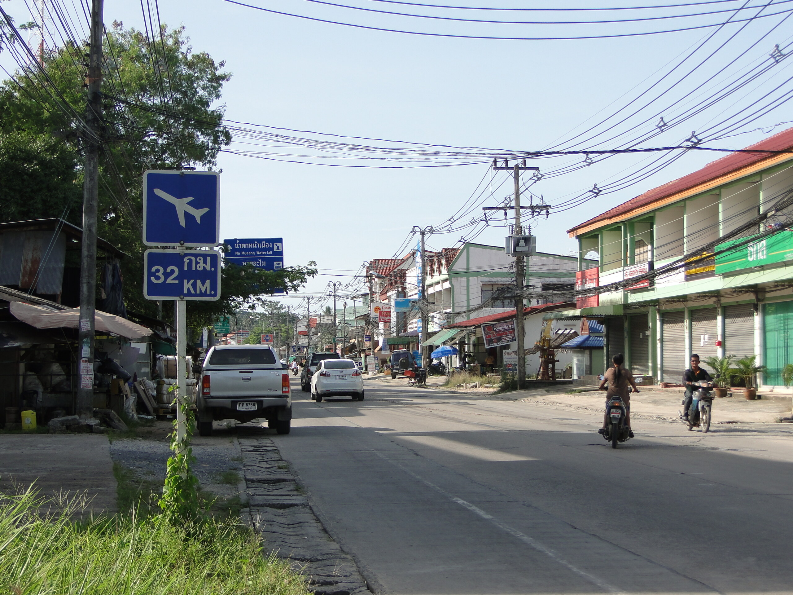

32 km

Ich werde als Experte der Freizeitgestaltung auf Samui immer wieder gefragt, was man denn gesehen haben muss, um das "echte" Samui besucht zu haben und zuhause Punkte zu sammeln. Daher habe ich mich entschlossen, als Archivar unserer Insel in einer kleinen Serie die Sehenswürdigkeiten Samuis zusammenzutragen.

Heute: Das 32km-Schild in Nathon.

Das Schild zeigt die Entfernung zum Flughafen. Die Ringroad selbst ist etwa 52 km lang, weshalb dieses Schild am weitesten entfernt vom Airport und damit dem Rest der Welt ist.

Muss man gesehen haben, sonst war man nicht auf Samui.

<!-- grammar-ignore FRAGEZEICHEN_STATT_PUNKT . -->
