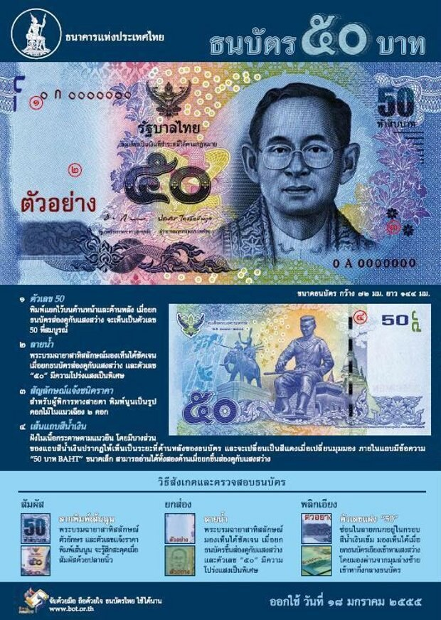

50 baht

Am 18. Januar 2012 gibt die thailändische Staatsbank (BOT) eine neue 50Baht-Note heraus. Das Datum ist genau gewählt, weil auf der Rückseite (auf der Vorderseite ist wie immer König Bhumibol abgebildet) König Naresuan dargestellt ist und am 18. Januar "sein" Feiertag ist.

Auf die gleiche Art und Weise werden in den nächsten Jahren vermutlich die anderen neuen Banknoten herausgegeben, eine pro Jahr:

* 20 Baht an einem 29. Mai (König Ramkhamhaeng)
* 500 Baht an einem 6. April (König Rama I)
* 1000 Baht an einem 23. Oktober (König Chulalongkorn) und
* 100 Baht an einem 28. Dezember (König Taksin)

Die Rückseite soll je nachdem wie man den Geldschein hält von rot nach blau scheinen. Bin gespannt wie sich das Geld dann anfühlen wird.
