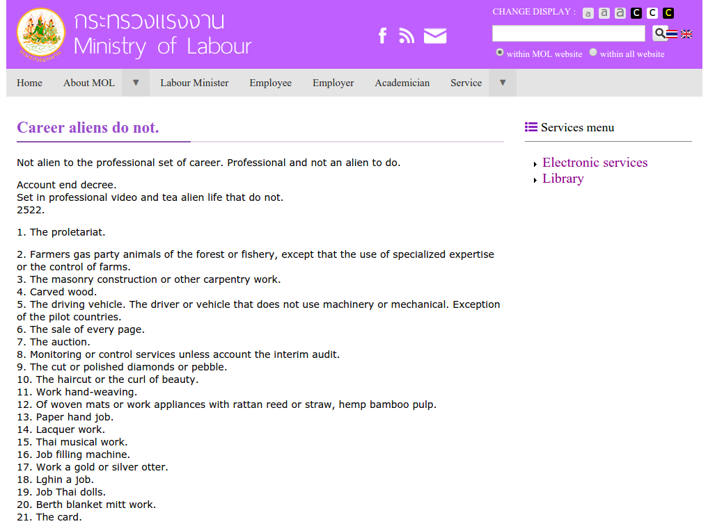

Neulich hat das Thailändische Arbeitsministerium eine Liste der Jobs, die man als Ausländer in Thailand nicht ausüben darf, veröffentlicht. Zu dumm nur, dass der Azubi bei seiner Bewerbung bei den Angaben zu den Sprachen die er spricht gelogen hat und anscheinend Google Translate genutzt hat.

Und so gibt es interessante Beschränkungen wie bspw:

* Das Proletariat
* Den Verkauf jeder Seite
* Arbeit an goldenen oder silbernen Ottern
* Tätigkeiten als Thai-Puppe
* Jobs als Buddha
* Dinge die man von Hand rollt
* und viele mehr

Ausser Onlinemarketing bleibt einem da wirklich nicht viel mehr ;)
