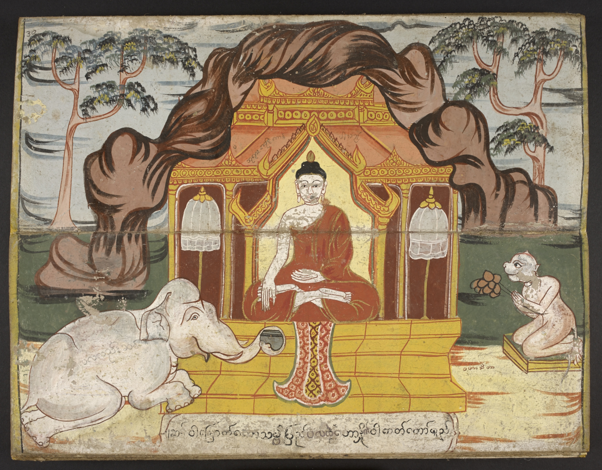

Morgen, am 16. July (dem Juli-Vollmond-Tag) begehen Buddhisten den Asalha Puja Tag.

Asalha Bucha ist der Jahrestag, an dem Buddha erleuchtet wurde und begann, seine Predigten zu den vier "Edlen Wahrheiten" zu halten. Diese vier Wahrheiten sind das Leidens, die Gründe des Leidens, das Ende des Leidens und des Weges der zum Ende des Leidens führt.

Diese Vier Wahrheiten werden übrigens unterschiedlich interpretiert, wie das so nun mal ist. Die Deutsche Bhuddistische Union interpretiert sie folgendermaßen:

> - Das Leben im Daseinskreislauf ist letztlich leidvoll. - Ursachen des Leidens sind Gier, Hass und Verblendung. - Erlöschen die Ursachen, erlischt das Leiden. - Zum Erlöschen des Leidens führt der Edle Achtfache Pfad.
>
> — [Wikipedia](https://de.wikipedia.org/wiki/Vier_Edle_Wahrheiten)

Am darauffolgenden Tag (Mittwoch) beginnt die Buddhistische Fastenzeit (Bhuddist Lent), die man allerdings nicht unbedingt mit der christlichen Fastenzeit vergleichen sollte.

Vielmehr ist das ein Mittel, um die Mönche zur Regenzeit in ihren Klöstern zu halten, damit sie auf ihren morgendlichen Runden nicht über die frisch besäten Felder laufen.

Alkohol zu verkaufen oder den Verkauf zu fördern ist übrigens an beiden Tagen (wie an vielen Buddha-Tagen) unter Strafen bis zu sechs Monaten Gefüngnis oder 10.000 THB verboten.

-   [Die Vier Edlen Wahrheiten auf Wikipedia](https://de.wikipedia.org/wiki/Vier_Edle_Wahrheiten)
