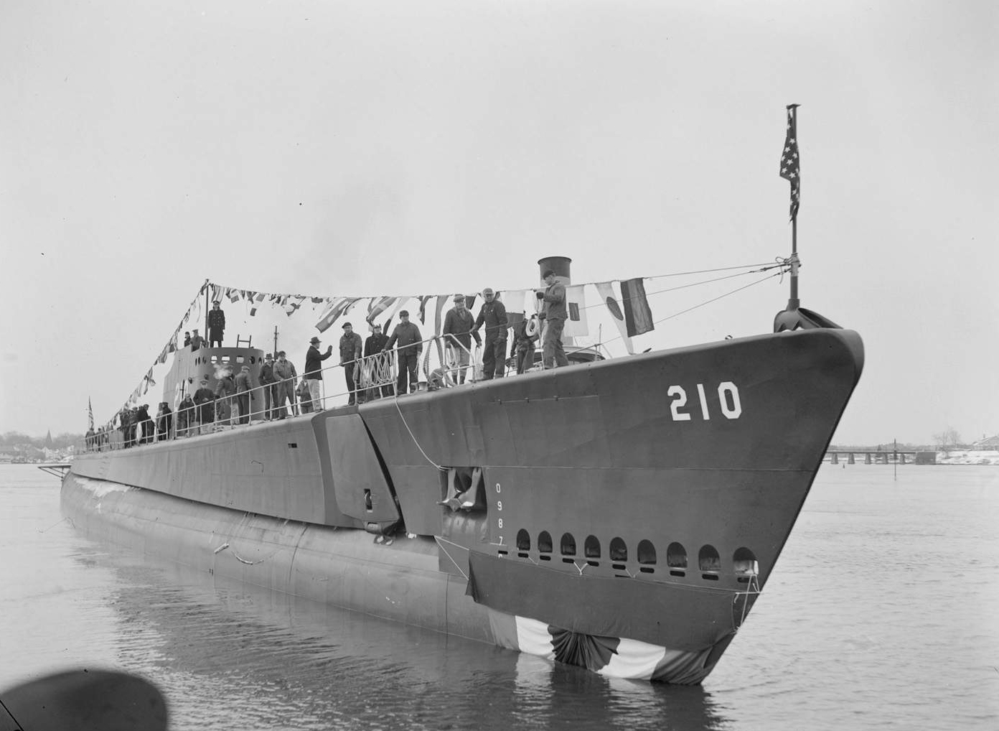

150km vor Phuket haben Taucher in den vergangenen Monaten ein amerikanisches U-Boot gefunden, das im zweiten Weltkrieg dort gesunken ist. Die USS Grenadier ist eines von 42 im zweiten Weltkrieg versenkten US-U-Booten. Im April 1943 wurde es nach Bombardierungen durch Japanische Flieger aufgegeben, um dann am nächsten Morgen durch weitere Bomben versenkt zu werden. Die Soldaten des U-Boots wurden festgenommen und (typisch für die japanische Kriegführung) durch verschiedene Gefangenenlager gereicht und gefoltert. Von den 76 Soldaten starben vier in dieser Zeit.

Wie auch immer&hellip; Interessant, wo Amerikaner und Japaner sich so rumgetrieben haben im zweiten Weltkrieg. Thailand hat (natürlich) am zweiten Weltkrieg nicht teilgenommen und war niemals Teil einer der Seiten im Krieg.

Auf Youtube kann man Videos von den Tauchgängen sehen.

<dnb-youtube videoid="WMcJ-sac_1g"></dnb-youtube>

-   [Divers May Have Found US Submarine Lost in WWII South of Phuket](https://www.khaosodenglish.com/news/crimecourtscalamity/2020/09/17/divers-may-have-found-us-submarine-lost-in-wwii-south-of-phuket/)
-   [USS Grenadier (SS 210) auf alchetron](https://alchetron.com/USS-Grenadier-(SS-210))
-   [USS Grenadier (SS 210) auf Wikipedia](https://en.wikipedia.org/wiki/USS_Grenadier_(SS-210))
-   [Thailand in World War II](https://en.wikipedia.org/wiki/Thailand_in_World_War_II)
