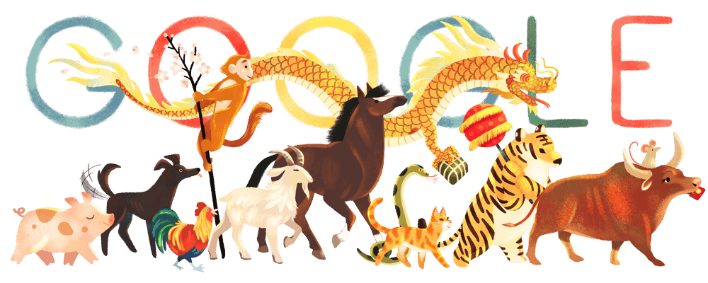
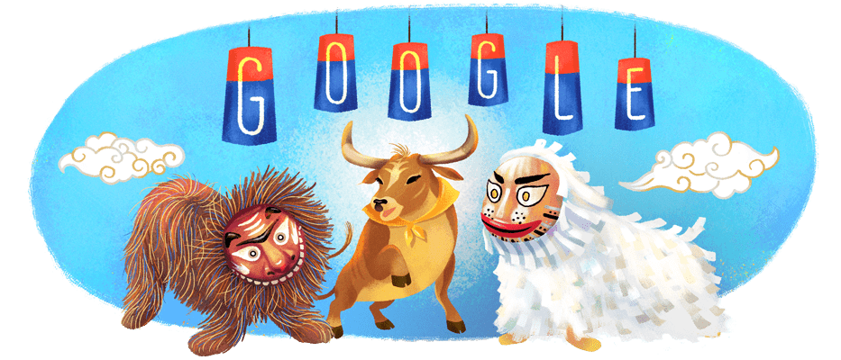
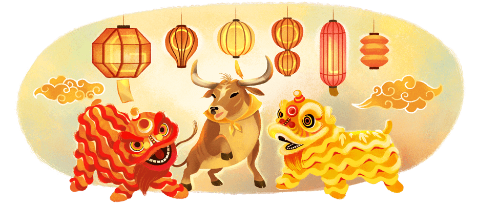

Das Google Doodle für das Chinesische Neujahr 2021. Das Jahr des Ochsens beginnt...

Das Jahr des Ochsen soll ein Jahr sein, in dem die Dinge etwas langsamer, aber damit auch stabiler laufen. Der Ochse symbolisiert gute Ernten und harte Arbeit - und damit (wie irgendwie in jedem Jahr) viel Gl&uuml;ck. 
